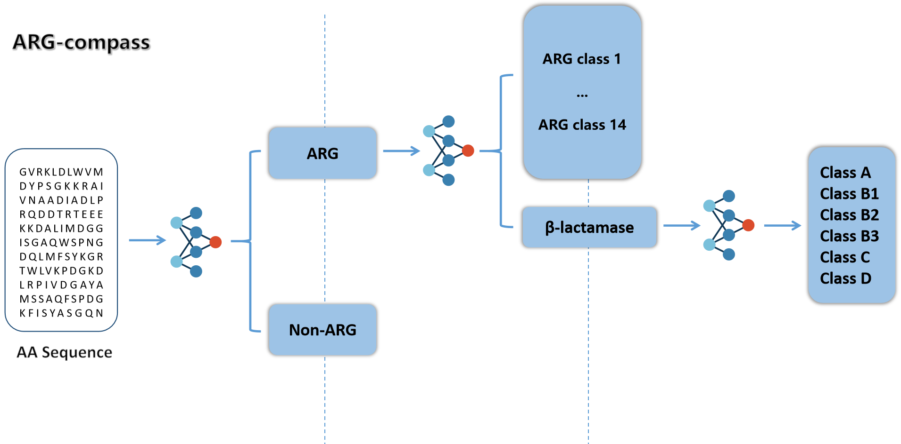

<div align=center></div>

# AR-Compass

#### Navigating Antibiotic Resistance in the Sequences Ocean.

- Author: Haiyang Hou
- Date: 2024-02-19
- Version: v0.2.0
- If you want to use this package, please indicate the source and tell me in "lssues". Free use.

## Description

This project is based on Python 3.7+ and developed using PyCharm on Windows 10+ (11).

3 computers for development and testing:

- Desktop: Windows 10, NVIDIA GeForce RTX 2060 Super 6GB, PyCharm 2021, Python 3.7, PyTorch 1.6.0, [2021-2023]

- Laptop: Windows 11, NVIDIA GeForce MX450 2GB, PyCharm 2022, Python 3.7, PyTorch 1.6.0, [2022-2023]

- Desktop: Windows 11, NVIDIA GeForce RTX 4070 Super 12GB, PyCharm 2023, Python 3.11, PyTorch 2.1.0, CUDA 12.1, [2024]

<div align=center></div>


## Installation
Requirements: python>=3.7, pytorch>=1.6.0, NVIDIA GPU

Refer to requirements.txt

Pay attention to the installation of scikit-learn package.

## Get models
Please get the complete models and test dataset from the following link.

```text
https://pan.baidu.com/s/1_rnhuvaoUzl0VLPV0sKaQA?pwd=rxzz 
```

## Use examples

### Stage1

Predict if it is an ARG, parameter -p represents the threshold: extract sequences with predicted ARG probability greater than the threshold and generate fasta files.

```shell
python ARCompassStage1.py -i data/test01.Stage1.fasta -o result/test01/ -p 0.9
```

### Stage2
Predict 15 classes of ARG, parameter -p represents the threshold: extract sequences with predicted beta_lactam probability greater than the threshold and generate fasta files.

```shell
python ARCompassStage2.py -i data/test01.Stage2.fasta -o result/test01/ -p 0.9
```
### Stage3
Predict 6 subclasses of β-lactam.

```shell
python ARCompassStage3.py -i data/test01.Stage3.fasta -o result/test01/
```

## Help
```shell
python ARCompassStage1.py -h
```
```text
usage: ARCompassStage1.py [-h] [-i INPUT] [-o OUTPUT] [-b BATCHSIZE] [-p PROB_ARG]

options:
  -h, --help            show this help message and exit
  -i INPUT, --input INPUT
                        Import fasta file
  -o OUTPUT, --output OUTPUT
                        Export folders
  -b BATCHSIZE, --batchSize BATCHSIZE
                        Batch size
  -p PROB_ARG, --prob_ARG PROB_ARG
                        Confidence threshold predicted as ARG, Extract fasta
```

```shell
python ARCompassStage2.py -h
```
```text
usage: ARCompassStage2.py [-h] [-i INPUT] [-o OUTPUT] [-b BATCH_SIZE] [-p PROB_BETA_LACTAM]

options:
  -h, --help            show this help message and exit
  -i INPUT, --input INPUT
                        Import fasta file
  -o OUTPUT, --output OUTPUT
                        Export folders
  -b BATCH_SIZE, --batch_size BATCH_SIZE
                        Batch size
  -p PROB_BETA_LACTAM, --prob_beta_lactam PROB_BETA_LACTAM
                        Confidence threshold predicted as beta_lactam, Extract fasta
```

```shell
python ARCompassStage3.py -h
```
```text
usage: ARCompassStage3.py [-h] [-i INPUT] [-o OUTPUT] [-b BATCH_SIZE]

options:
  -h, --help            show this help message and exit
  -i INPUT, --input INPUT
                        Import fasta file
  -o OUTPUT, --output OUTPUT
                        Export folders
  -b BATCH_SIZE, --batch_size BATCH_SIZE
                        Batch size
```